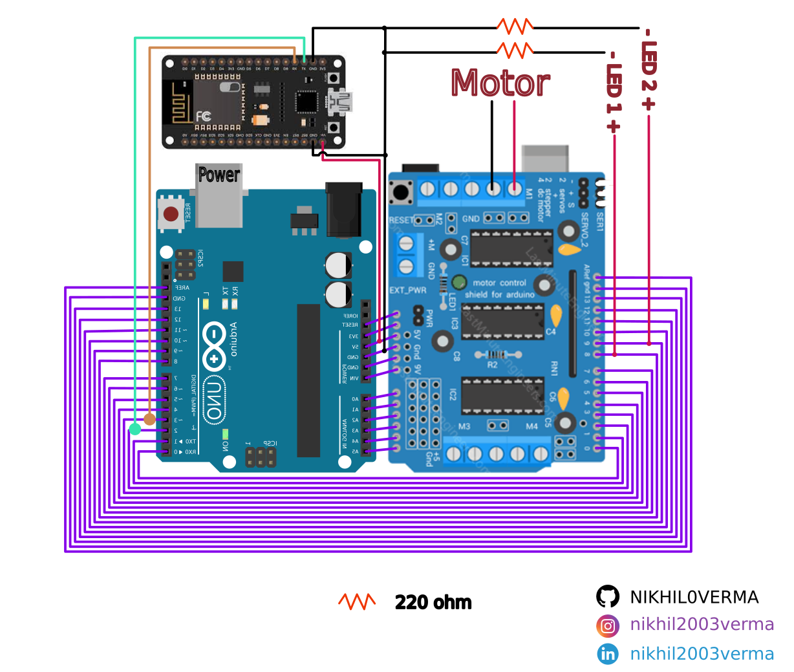

# Arduino Home Automation
Hey all :smile:,

This repo is about controlling 2 LED and 1 DC motor using Arduino Uno and ESP8266.

## Requirments
Hardwares [Buy Boards](https://clk.asia/Vision_Home)
* Arduino Uno (Other can also be used)
* ESP8266 (NodeMCU)
* HW-130 motor Driver
* Connecting wire
* USB (Arduino and NodeMCU)
* LED x 2
* DC Motor

Software
* [Arduino IDE](https://www.arduino.cc/en/software)

## How to use
Clone this repo locally.

### Coding
* Open [ESP code](esp8266.ino) in Arduino IDE.
* Goto `Sketch > Include Library > Add .ZIP Library...` and select all zip files one by one.
* Goto `File > Preference...` in setting section scroll down.
    * Paste `http://arduino.esp8266.com/stable/package_esp8266com_index.json` into Additional boards manager URLs
    * Save and let it download
* Connect NodeMCU to System using USB.
    * Select port of NodeMCU
    * In Board section Seach for NodeMCU 1.0 (ESP-12E Module)
* Upload code to NodeMCU using IDE or `Ctrl + U` shortcut.
* Open [Arduino code](arduino.ino) in Arduino IDE.
* Connect Arduino Uno using its USB connector and Upload the code

### Electrical connection
* Connect Arduino Uno, NodeMCU and HW-130 Motor driver using circuit diagram given below

### Access
* Connect to `Vision Home` using `12345678`
* Goto 192.168.2.1
* Login using 
    * username - admin
    * password - Admin@123
* Turn on/off LEDs or motor :wink: